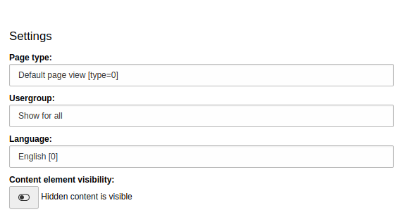

.. _configuration:

===================
Configuration
===================

Feature Flags
=============

To modify the settings for this extension, you can use either `LocalConfiguration.php` or `AdditionalConfiguration.php`.

**headless.storageProxy**

Enables the ability to set a storage proxy in the site configuration (and its variants) & serve files via proxy from the same domain.

Feature flag requires TYPO3 >= 10.4.10.

*WARNING* If you install `TYPO3 >= 10.4.18`, please update `ext:headless` to version `>= 2.5.3`.

.. code-block:: php

   $GLOBALS['TYPO3_CONF_VARS']['SYS']['features']['headless.storageProxy'] = true;

**headless.redirectMiddlewares**

Enables new and replaces core middlewares for handling redirects. Headless mode requires redirects to be handled by the frontend app.

.. code-block:: php

   $GLOBALS['TYPO3_CONF_VARS']['SYS']['features']['headless.redirectMiddlewares'] = true;

To enable headless support for `EXT:redirect`, add the following flag to your site configuration's YAML file:

.. code-block:: yaml

   headless: true

**headless.nextMajor**

Enables new APIs/behaviors of `ext:headless`, which may contain breaking changes and require an upgrade path for your application. Use with caution.

.. code-block:: php

   $GLOBALS['TYPO3_CONF_VARS']['SYS']['features']['headless.nextMajor'] = true;

**headless.elementBodyResponse**

Available since `2.6`.

Enables clean output middleware for plugins. Clean output is available for POST/PUT/DELETE method requests. To get clean output for plugins on a page, enable this flag and add `headless` to the site configuration, then send the `responseElementId` field with the ID of the plugin in the body with plugin data.

`LocalConfiguration.php`

.. code-block:: php

   $GLOBALS['TYPO3_CONF_VARS']['SYS']['features']['headless.elementBodyResponse'] = true;

`Site configuration`:

Add the following flag to your site configuration's YAML file:

.. code-block:: yaml

   headless: true

Example POST request with plugin form. Replace `#ELEMENT_ID#` with the ID of the plugin from the page response.

.. code-block:: php

   POST https://example.tld/path-to-form-plugin
   Content-Type: application/x-www-form-urlencoded

   responseElementId=#ELEMENT_ID#&tx_form_formframework[email]=email&tx_form_formframework[name]=test...

To find a nested element, use the new flag `responseElementRecursive`, where `responseElementId` is the child (nested element). Example request:

.. code-block:: php

   POST https://example.tld/path-to-form-plugin
   Content-Type: application/x-www-form-urlencoded

   responseElementId=#ELEMENT_ID#&responseElementRecursive=1&tx_form_formframework[email]=email&tx_form_formframework[name]=test...

**headless.simplifiedLinkTarget**

Available since `2.6`.

Enables simplified target links' property.

.. code-block:: php

   $GLOBALS['TYPO3_CONF_VARS']['SYS']['features']['headless.simplifiedLinkTarget'] = true;

Simplified output returns only the value, e.g., `_blank` for the target attribute instead of the HTML string ` target="_blank"`.

**headless.jsonViewModule**

Available since `3.0`.

Enables the experimental JsonView backend module, which allows previewing the page JSON response in the backend module when passing specific pageType, pageArguments, usergroups, language.

This flag requires an additional extension `friendsoftypo3/headless-dev-tools`.

.. code-block:: php

   $GLOBALS['TYPO3_CONF_VARS']['SYS']['features']['headless.jsonViewModule'] = true;

**headless.workspaces**

Enables `EXT:workspaces` preview support.

.. code-block:: php

   $GLOBALS['TYPO3_CONF_VARS']['SYS']['features']['headless.workspaces'] = true;

To enable headless support for `EXT:workspaces`, add the following flag to your site configuration's YAML file:

.. code-block:: yaml

   headless: true

**headless.pageTitleProviders**

Enables support for the PageTitle API.

.. code-block:: php

   $GLOBALS['TYPO3_CONF_VARS']['SYS']['features']['headless.pageTitleProviders'] = true;

Availability of Feature Toggles by Version
------------------------------------------

.. t3-field-list-table::
   :header-rows: 1

   -  :Header1:   Flag
      :Header2:   2.x
      :Header3:   3.x
      :Header4:   4.x

   -  :Header1:   FrontendBaseUrlInPagePreview
      :Header2:   available
      :Header3:   removed
      :Header4:   removed

   -  :Header1:   headless.frontendUrls
      :Header2:   >= 2.5
      :Header3:   available
      :Header4:   removed

   -  :Header1:   headless.storageProxy
      :Header2:   >= 2.4
      :Header3:   available
      :Header4:   available

   -  :Header1:   headless.redirectMiddlewares
      :Header2:   >= 2.5
      :Header3:   available
      :Header4:   available

   -  :Header1:   headless.nextMajor
      :Header2:   >= 2.2
      :Header3:   currently not used
      :Header4:   currently not used

   -  :Header1:   headless.elementBodyResponse
      :Header2:   >= 2.6
      :Header3:   available
      :Header4:   available

   -  :Header1:   headless.simplifiedLinkTarget
      :Header2:   >= 2.6
      :Header3:   removed
      :Header4:   not available

   -  :Header1:   headless.jsonViewModule
      :Header2:   not available
      :Header3:   >= 3.0
      :Header4:   >= 3.0

   -  :Header1:   headless.workspaces
      :Header2:   not available
      :Header3:   >= 3.1
      :Header4:   >= 3.1

   -  :Header1:   headless.pageTitleProviders
      :Header2:   not available
      :Header3:   not available
      :Header4:   >= 4.2.3

.. _configuration-ext-form:

EXT:form
========

If `EXT:form` is enabled in the TYPO3 instance, `EXT:headless` provides support for handling forms in headless mode.

Standard forms designed in the form editor in TYPO3 backend should work out of the box, but the headless extension supports additional small tweaks/features to help frontend developers better handle forms on their end.

All options are added in YAML files with standard form configuration in TYPO3.

**i18n**

In many cases in headless mode, frontend developers need some translated strings for common elements like buttons, help messages, etc.

With `EXT:headless`, you can add additional configuration in the root line of the form config:

.. code-block:: yaml

   i18n:
     identifier: 'i18n'
     properties:
        someButtonLabel: 'Submit or Cancel'
        someHelpMessage: 'You need to fill out this form'
        requiredFields: 'These fields are required'

The above block will be automatically translated by provided XLF files like a standard form in fluid.

This block will be translated & available in the "i18n" part of the response. More about form output can be found in the Form Decorator section.

**Form Decorator**

The headless extension provides an out-of-the-box simple decorator for form definition output. The decorator simplifies the response and provides an API to customize your response for your specific needs.

In the rendering options of the form, you can define your custom project/form decorator. If the option is not defined, the headless extension defaults to:

`FriendsOfTYPO3\Headless\Form\Decorator\FormDefinitionDecorator`

You can override this at any time by specifying it in the form's config YAML:

.. code-block:: yaml

   renderingOptions:
     formDecorator: Your-Vendor\YourExtension\Form\CustomDefinitionDecorator

More about form output decorators can be found in :ref:`customize form output <developer-ext-form>`.

**Validators**

To help frontend developers create validation handling in a frontend context, you can add small tweaks to form element definitions to ease development for your frontend team.

In the form element definition, you can add an option to `errorMessage` for your defined validators with the error code value. This code will be picked up and translated by standard TYPO3 XLF form files.

For example:

.. code-block:: yaml

   renderables:
      -
         type: 'Page'
         identifier: 'page-1'
         label: 'Step'
         renderables:
            -
               properties:
                  options:
                     Mr: 'Mr'
                     Mrs: 'Mrs'
                  elementDescription: ''
                  fluidAdditionalAttributes:
                     required: required
               type: 'RadioButton'
               identifier: 'salutation'
               label: 'Salutation'
               validators:
                  -
                    identifier: 'NotEmpty'
                    errorMessage: 1221560910

When creating a RegexValidator, there are some differences when handling regular expressions by PHP & JS. To help frontend developers create consistent frontend/backend validation, we introduced a small option for regex validators in TYPO3.

For example:

.. code-block:: yaml

   renderables:
      -
         type: 'Page'
         renderables:
            -
              type: 'Text'
              identifier: 'testField'
              label: 'Test field'
              validators:
                -
                   identifier: 'RegularExpression'
                   options:
                     regularExpression: '/^[a-z]+$/'
                   FERegularExpression:
                     expression: '^[a-z]+$'
                     flags: 'i'
                   errorMessage: 1221565130

If the headless form decorator finds the option `FERegularExpression` in the validator definition, it will override `options.regularExpression` with the value of the `FERegularExpression` option before sending the output to the frontend developer.

**Custom Options**

When you need a select/radio/checkbox with custom options fetched from, for example, a database or another external source, you need to create a Custom FormModel. In headless mode, we do not render HTML and render all the options, so we introduced a small interface:

`FriendsOfTYPO3\Headless\Form\CustomOptionsInterface`

and `customOptions` in the definition of the form element:

.. code-block:: yaml

   - defaultValue: ''
     type: 'SingleSelectWithCountryList'
     identifier: 'country'
     label: 'Country'
     properties:
        customOptions: 'YourVendor\Your-Ext\Domain\Model\YourCustomOptionClassImplementingInterface'

When the above option is set with a class that implements the correct interface, the options of the select element will be replaced by the values returned by the specified class.

To make rendering of the element easier for frontend developers, we introduced the option to override the type returned to the frontend developer. For example, when you set `FEOverrideType` in the renderingOptions of a custom element:

.. code-block:: yaml

   type: 'SingleSelectWithCountryList'
   renderingOptions:
     FEOverrideType: 'Select'

We use this value to override the type, so the response to the frontend developer will be:

.. code-block:: yaml

   {
     "type": "Select"
   }

instead of:

.. code-block:: yaml

   {
     "type": "SingleSelectWithCountryList"
   }

**JSON Redirect**

`EXT:headless` supports handling finishers. For example, after handling correctly sent form data, you can use TYPO3 core's RedirectFinisher to redirect to a thank you page. To have more control on the frontend side, we provide in the headless extension:

`JsonRedirectFinisher`

This is based on the core RedirectFinisher but, instead of delay & statusCode options, has an option for a message that can be handled by the frontend developer to display a message for the user before redirecting to the defined page.

Also, JsonRedirect does not redirect by itself but generates a message (default is null) and URI for redirection by the frontend developer.

To use JsonRedirect, define it in the setup.yaml of your extension form's setup:

.. code-block:: yaml

   TYPO3:
     CMS:
       Form:
         prototypes:
           standard:
             finishersDefinition:
               JsonRedirect:
                 implementationClassName: 'FriendsOfTYPO3\Headless\Form\Finisher\JsonRedirectFinisher'

[BETA] JsonView Backend Module
==============================

|

The JsonView module is an experimental approach for previewing JSON responses of a page in different contexts like pageType, page arguments, usergroup, language, and show/hide hidden content.

``!WARNING This is an experimental module, please don't use it on a production environment at this time.``

.. image:: ../Images/Configuration/JsonViewModule-example.png
  :alt: Root page for the API endpoint

|

**PageTypeModes**

You can set the context in which you want to preview a page.

By default, there are 3 settings available:

- *default* - standard response with page data and content
- *initialData* - standard response from pageType=834
- *detailNews* (commented out) - example of calling the detail action of the news extension for test purposes

|

.. code-block:: yaml

    pageTypeModes:
      default:
        title: Default page view
        pageType: 0
        bootContent: 1
        parserClassname: FriendsOfTYPO3\Headless\Service\Parser\PageJsonParser

      initialData:
        title: Initial Data
        pageType: 834
        parserClassname: FriendsOfTYPO3\Headless\Service\Parser\DefaultJsonParser

    #  Example of detail news preset
    #
    #  detailNews:
    #    title: Detail news
    #    pageType: 0
    #    bootContent: 1
    #    arguments:
    #      tx_news_pi1:
    #        action: detail
    #        controller: News
    #        news: 1

|

**Custom YAML Configuration**

You can always create your own YAML configuration and set it in the extension configuration.

.. image:: ../Images/Configuration/JsonViewModule-extconf.png
  :alt: Root page for the API endpoint
